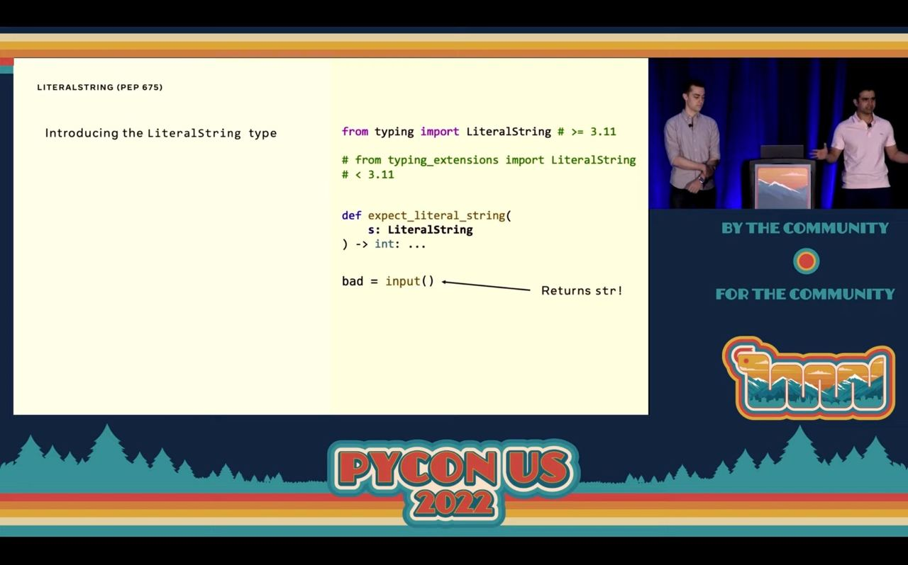

# Literal

Provides string safety through a "literal string" class, preventing injection attacks such as SQL injection and OS command injection.

## A Great Idea From Another Great Language

Injection attacks have been one of the most popular web application attacks to date. Fundamentally, there is an issue of differentiating potentially dangerous and dynamic strings from purely static ones, especially in large codebases.

This concept is similar to [PEP675](https://peps.python.org/pep-0675/) in [Python 3.11](https://docs.python.org/3.11/whatsnew/3.11.html#pep-675-arbitrary-literal-string-type).



By differentiating developer-defined, static strings from dynamic ones constructed from user input, developers are able to more easily prevent injection attacks.

## Example Usage

Here, we provide a way of telling regular strings apart from a new class of strings called `LiteralString`s (or as we prefer, "l-strings"), allowing type checkers to enforce static strings even in vanilla JavaScript. While vanilla JavaScript is not typed, developers can easily verify l-strings using `isLiteralString` (or just `instanceof`).

To create an l-string, use the tagged template literal:

```javascript
l`SELECT * FROM students`;
```

These l-strings can interpolate with **other l-strings**, but **not regular strings**.

```javascript
l`SELECT * FROM ${l`users`};`;
```

is fine, but

```javascript
l`SELECT * FROM ${'users'};`;
```

isn't.

Use l-strings to create and construct static strings, then validate that the final, resulting string is also an l-string before passing it into a sensitive function.

```javascript
const { literal } = require('@zenots/zeno');

const { l, isLiteralString } = literal;

const runQuery = (sql) => {
  if (isLiteralString(sql)) {
    console.log(`This is a safe literal string: ${sql}`);
  } else {
    console.log(`Not a literal string, could be unsafe: ${sql}`);
  }
};

/**
 * @param {string} arbitraryString
 * @param {LiteralString} queryString
 * @param {LiteralString} tableName
 * @returns {void}
 */
const caller = (arbitraryString, queryString, tableName) => {
  runQuery(l`SELECT * FROM students`); // ok
  runQuery(queryString); // ok
  runQuery(l`SELECT * FROM ${tableName}`); // ok
  runQuery(arbitraryString); // type checker error
  runQuery(`SELECT * FROM students WHERE name = ${arbitraryString}`); // type checker error
};

userInput = 'foo';
caller(userInput, l`bar`, l`baz`);
```

## String Methods

The following [String](https://developer.mozilla.org/en-US/docs/Web/JavaScript/Reference/Global_Objects/String/) methods can return an l-string when called on l-strings:

### `LiteralString.concat(str1, str2, /* …, */ strN)`

Cconcatenates the string arguments to the calling l-string.

Returns a `LiteralString` if all arguments are `LiteralString`s, otherwise returns a regular string.

### `LiteralString.replace(searchValue, replaceValue)`

Replaces `searchValue` with `replaceValue`.

Returns a `LiteralString` if `replaceValue` is a `LiteralString`, otherwise returns a regular string.

### `LiteralString.slice(indexStart[, indexEnd])`

Extracts a section of a l-string and returns a new l-string.

Returns a `LiteralString`.

### `LiteralString.split([seperator[, limit]])`

Divides a l-string into an ordered list of substrings, puts these substrings into an array, and returns the array.

Returns an array of `LiteralString`s.

### `LiteralString.substring(indexStart[, indexEnd])`

Extracts the characters in a l-string between `indexStart` and `indexEnd`, not including `indexEnd` itself.

Returns a `LiteralString`.

### `LiteralString.toLowerCase()`

Returns the calling l-string value converted to lower case.

Returns a `LiteralString`.

### `LiteralString.toUpperCase()`

Returns the calling l-string value converted to upper case.

Returns a `LiteralString`.

### `LiteralString.trim()`

Removes whitespace from both ends of a l-string.

Returns a `LiteralString`.

### `LiteralString.trimEnd()`

Removes whitespace from the end of a l-string.

Returns a `LiteralString`.

### `LiteralString.trimStart()`

Removes whitespace from the beginning of a l-string.

Returns a `LiteralString`.
